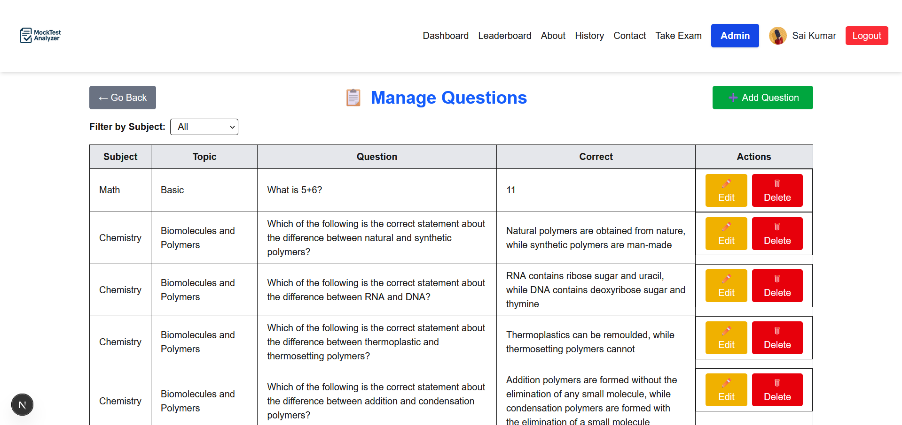
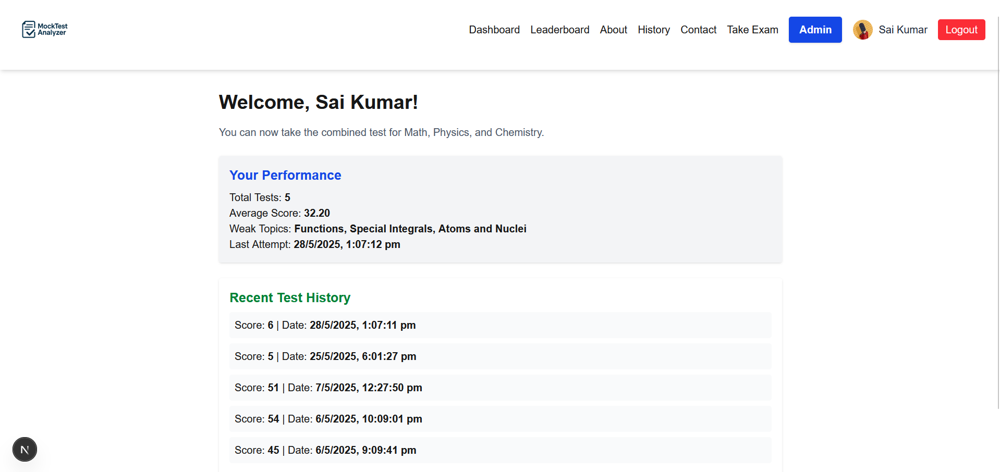
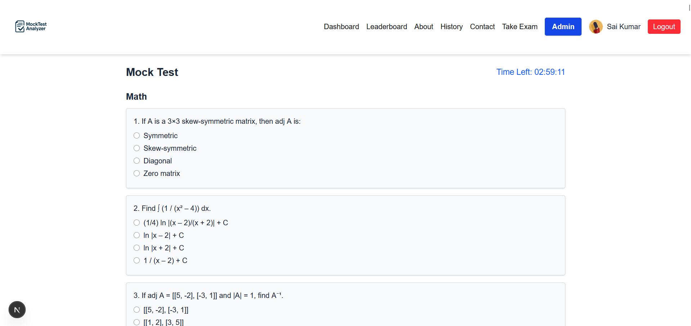
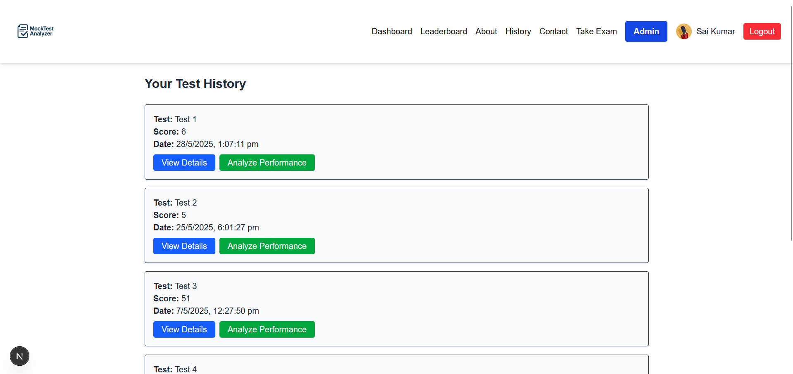

# Mock Test Analyzer 🎯

Mock Test Analyzer is a full-stack web application designed to help students take mock exams, track their performance, and get detailed analytics based on subjects and topics. It also provides administrators with tools to manage questions and monitor student progress.

## 🚀 Features

- 👨‍🎓 Student login/signup (email + Google)
- ✅ Take subject-wise mock tests (Physics, Chemistry, Math)
- ⏱️ Real-time timer with auto-submit
- 📊 Instant score + detailed result analysis
- 📈 Weak/strong topic analysis and charts
- 🧑‍💻 Admin panel to add/edit/delete questions
- 🧠 Leaderboard based on score & attempts
- 👤 User profile page with profile picture and editable name
- 🌙 Dark/light theme + mobile responsive design

## 🛠️ Tech Stack

- **Frontend:** Next.js (App Router), TailwindCSS
- **Backend:** Node.js + Next.js API routes
- **Database:** MySQL with Prisma ORM
- **Authentication:** NextAuth (Google & credentials)
- **Hosting:** Vercel (Frontend + API) / Railway (Database)

## 📸 Screenshots

## 📸 Screenshots

### 🧑‍🏫 Admin Panel
> View and manage users, questions, and performance insights as an admin.


### 🏠 Dashboard
> A user-friendly overview showing user info and quick actions.


### 📝 Exam Page
> Users can take subject-wise mock tests with a timer and preview.


### 📜 History Page
> Displays previous attempts and detailed performance breakdowns.



## ⚙️ Setup Instructions

### 1. Clone the Repo

```bash
git clone https://github.com/your-username/mock-test-analyzer.git
cd mock-test-analyzer


✅ Future Enhancements

    👥 Peer-to-peer discussion or chat

    🧑‍🏫 Request-to-be-admin system

    📱 Mobile app using React Native

    🧠 AI-based feedback or adaptive testing

    🌐 Multilingual support

👨‍💻 Developer Info

    Built by: S S Sai Kumar

    College: The National Institute of Engineering

    Tech Stack Used: Full-Stack (Next.js + Prisma + MySQL)

    Deployment: Vercel (Frontend/API) + Railway (DB)